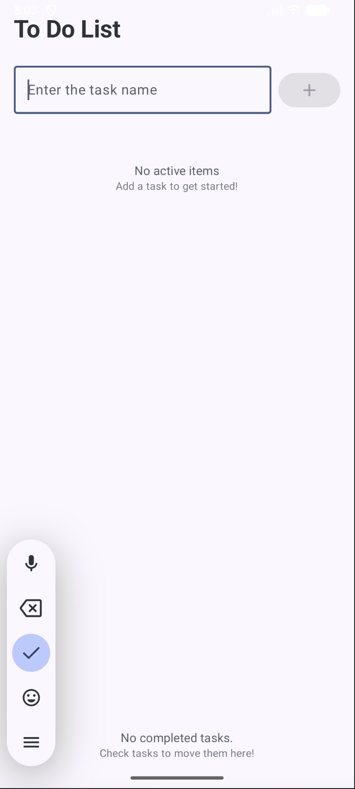
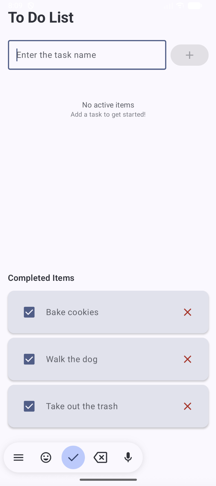
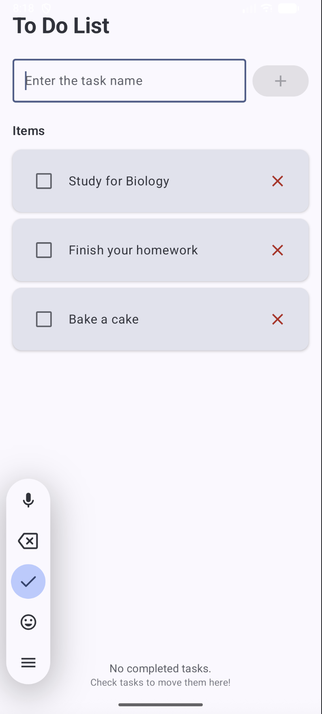
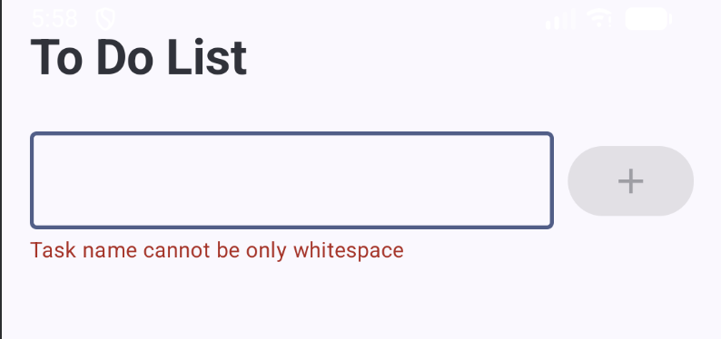

# App Overview 
This to-do list app allows user to:
- Add tasks
- Delete tasks
- Mark tasks as complete/incomplete using checkboxes
- View their tasks in organized sections (Completed and To-Do)

## Main Screen


## Empty Screen


## Completed List Screen (only completed tasks)


## To Do List Screen (only active tasks)


## Input Validation - ensures that the user cannot enter whitespace


# Concepts Used:
## Data Class
- The app uses a TodoItem data class in order to model each task that is created. This allows for a clean and readable data structure that comes with automatic equals(), hashCode(), and toString() implementations. For example, this means that I did not have to write custom comparison logic.
```kotlin
data class TodoItem(
    val id: Long,
    val text: String,
    val isCompleted: Boolean = false,
    val createdAt: Long = System.currentTimeMillis()
)
```
## State Management
I made use of Compose's state management system for the app.
- rememberSaveable: This allowed me to preserve the state of the tasks throughout configuration changes, such as screen rotation.
- mutableStateOf(): This makes the state observable, and Compose automatically recomposes when the state changes.
```kotlin
var todoItems by rememberSaveable { mutableStateOf(listOf<TodoItem>())}
var newTaskText by rememberSaveable { mutableStateOf("") }
```
## State Hoisting
This app utilizes State Hoisting by making the TodoItemRow composable stateless. This means that it can be used in multiple places, which allows for reusability. It also simplifies testing and debugging, since the logic lives in one place (parent). 
```kotlin
TodoItemRow(
    item = item,
    onToggle = { toggledItem ->
        todoItems = todoItems.map { todo ->
            if (todo.id == toggledItem.id) {
                todo.copy(isCompleted = !todo.isCompleted)
            } else {
                todo
            }
        }
    },
    onDelete = { deletedItem ->
        todoItems = todoItems.filter { it.id != deletedItem.id}
    }
)
```
## Layouts and Modifiers
The app utilizes Jetpack Compose's layout system. The Column layout is used to stack UI sections vertically, while the Row layout is used to place the text field and the add button side by side. 
### Column Layout:
```kotlin
Column(
        modifier = Modifier
            .fillMaxSize()
            .padding(16.dp)
    ) {
        Text(
            text = "To Do List",
            style = MaterialTheme.typography.headlineMedium,
            fontWeight = FontWeight.Bold,
            modifier = Modifier.padding(bottom = 24.dp)
        )
```
### Row Layout:
```kotlin
Row(
    modifier = Modifier.fillMaxWidth(),
    verticalAlignment = Alignment.CenterVertically
) {
    OutlinedTextField(
        value = newTaskText,
        onValueChange = { newTaskText = it },
        placeholder = { Text("Enter the task name")},
        modifier = Modifier
            .weight(1f)
            .padding(end=8.dp),
        singleLine = true
    )

    Button(
        onClick = {
            val trimmedText = newTaskText.trim()
            if (trimmedText.isNotEmpty()) {
                val newItem = TodoItem(
                    id = System.currentTimeMillis(),
                    text = trimmedText
                )
                todoItems = todoItems + newItem
                newTaskText = ""
            }
        },
        enabled = newTaskText.trim().isNotEmpty()
    ) {
        Icon(Icons.Default.Add, contentDescription = "Add")
}
```
## Recomposition
The app updates the UI through Jetpack Compose's recomposition system. This means that when a task is added, deleted, or checked off as completed, only the affected parts of the UI update, rather than the entire screen itself.
```kotlin
LazyColumn(
    modifier = Modifier
        .weight(1f)
        .padding(bottom = 16.dp)
) {
    items(activeItems, key = { it.id }) { item ->
        TodoItemRow(
            item = item,
            onToggle = { toggledItem ->
                todoItems = todoItems.map { todo ->
                    if (todo.id == toggledItem.id) {
                        todo.copy(isCompleted = !todo.isCompleted)
                    } else {
                        todo
                    }
                }
            },
            onDelete = { deletedItem ->
                todoItems = todoItems.filter { it.id != deletedItem.id}
            }
        )
    }
}
```
